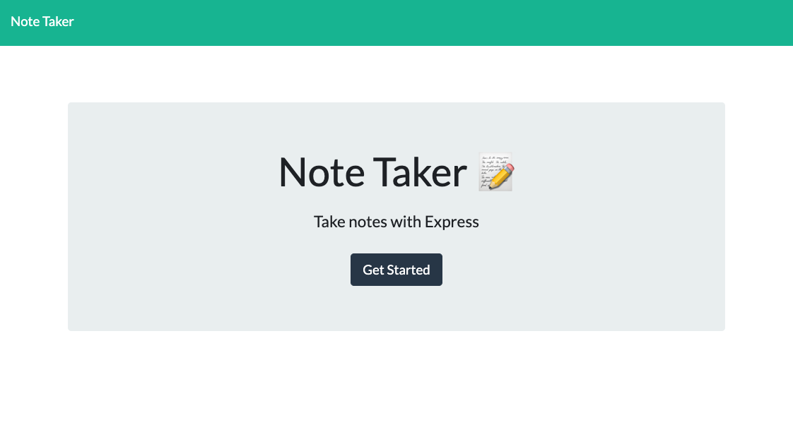
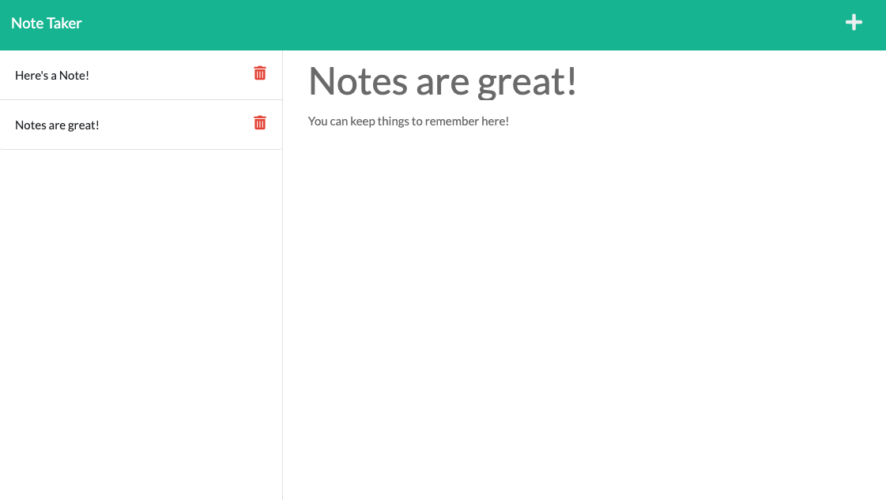

  # Just A Little Note
  

  ## Description
  Just A Little Note takes input from the user to create a list of notes to reference. You can add as many notes as you'd like, then delete notes to keep your list of notes clean. This application uses JavaScript with HTML and CSS on the frontend, with server integration with express.js and node.js on the backend.

  ## Table of Contents
  * [Installation](#installation)
  * [Usage](#usage)
  * [Credits](#credits)
  * [License](#license)
  * [Contributing](#contributing)
  * [Tests](#tests)
  * [Questions](#questions)
  
  ## Installation
  To simply use the application, follow the deployed application link. If you'd like to run it locally on your machine, you can copy this repo to your computer. In the local copied root folder of the application, run npm install in your command line to install dependencies. 

  ## Usage
  Run it through the deployed heroku app at the link listed below. To run locally on your machine after following the installation instructions above, run the command "npm start" to start the express server. From there, visit localhost:3001 to begin the application. Errors and confirmations will appear in the command line. (this app uses an express.js server, and node with express, fs, and path dependencies).

  ### Deployed link and screenshots
  https://just-a-little-note.herokuapp.com/

  
  
  

  ## Credits
  Starter code for this application, including HTML, CSS, and index.js files were created by Trilogy Education. © 2021 Trilogy Education Services, LLC, a 2U, Inc. brand. Confidential and Proprietary. All Rights Reserved. 

  ## License
  
  
### MIT LICENSE

Permission is hereby granted, free of charge, to any person obtaining a copy
of this software and associated documentation files (the "Software"), to deal
in the Software without restriction, including without limitation the rights
to use, copy, modify, merge, publish, distribute, sublicense, and/or sell
copies of the Software, and to permit persons to whom the Software is
furnished to do so, subject to the following conditions:

The above copyright notice and this permission notice shall be included in all
copies or substantial portions of the Software.

THE SOFTWARE IS PROVIDED "AS IS", WITHOUT WARRANTY OF ANY KIND, EXPRESS OR
IMPLIED, INCLUDING BUT NOT LIMITED TO THE WARRANTIES OF MERCHANTABILITY,
FITNESS FOR A PARTICULAR PURPOSE AND NONINFRINGEMENT. IN NO EVENT SHALL THE
AUTHORS OR COPYRIGHT HOLDERS BE LIABLE FOR ANY CLAIM, DAMAGES OR OTHER
LIABILITY, WHETHER IN AN ACTION OF CONTRACT, TORT OR OTHERWISE, ARISING FROM,
OUT OF OR IN CONNECTION WITH THE SOFTWARE OR THE USE OR OTHER DEALINGS IN THE
SOFTWARE.

  ## Contributing
  No contributing necessary for this application.

  ## Tests
  No tests necessary for this application.

  ## Questions
  You can find my GitHub profile at https://github.com/bgswilde
  For any further questions, reach out to me via email at bgswilde@gmail.com.
